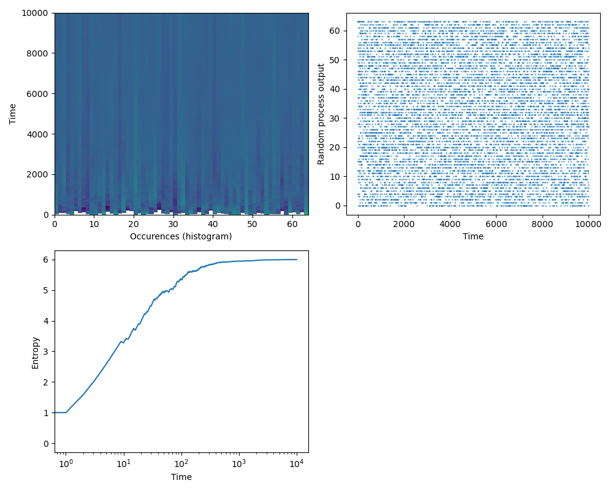

# Understanding-information-entropy
This code introduces us to the concept of information entropy. We take a discrete random process (a series of random variables) with a uniform distribution function giving values between 0 and N-1. At each point in time, we calculate the histogram of values up to this point which is an approximation of the probability distribution function of the random process. The entropy is calculated at each time point by entropy = -sum(p*log2(p)). Since the early time distribution has very few occurences the entropy starts low, and with time increases to its maximal value.

Here is a sample result with T=10,000 time steps and outcome space of integers between 0-63. The resulting information entropy at long times approches 6 which means we need on average 6 bits of information (2^6=64) to describe this process.

